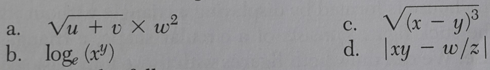

# IMPR-Lecture-5

## Gruppeopgaver
- [Opgave 5.7](src/exercise-5.7.c) (Nye funktioner i gamle opgaver) [KN slides](https://homes.cs.aau.dk/~normark/impr-c/functions-ekstr-opg-slide-exercise-3.html)
- [Opgave 5.2](src/exercise-5.2.c) (Find de første n primtal) [KN slides](http://people.cs.aau.dk/~normark/impr-c/functions-par-ex-2-slide-exercise-1.html)
- [Opgave 5.3](src/exercise-5.3.c) (Goldbachs formodning) [KN slides](http://people.cs.aau.dk/~normark/impr-c/functions-par-ex-2-slide-exercise-2.html)
- [Opgave 5.6](src/exercise-5.6.c) (Programmering af en kvadratrodsfunktion)  [KN slides](http://people.cs.aau.dk/~normark/impr-c/functions-ekstr-opg-slide-exercise-2.html)
- [Opgave 5.5](src/exercise-5.5.c) (Skudårsfunktionen) [KN slides](http://people.cs.aau.dk/~normark/impr-c/functions-ekstr-opg-slide-exercise-1.html)

## Hjemmeopgaver:
- [Self-Check opgave 1 side 143](src/exercise-PSPDC-143-1.c) fra afsnit 3.2 i Problem Solving and Program Design in C, eighth edition.
(Denne opgave er lidt anderledes i 7. udgave af bogen).
  - Rewrite the following mathematical expressions using C functions:
  - 
- [Programmeringsopgave 2 side 166](src/exercise-PSPDC-166-2.c) fra afsnit 3.5 i Problem Solving and Program Design in C, eighth edition.
  - Write a function that computes the time one must leave in order to reach a certain destination by a designated time. 
  You need to deal only with arrivals occurring later the in the same day as the departure. 
  Function inputs include the arrival time as an integer on a 24-hours clock (20:30 is given as 2030), 
  the distance to the destination in kilometers, and the speed you plan to average in km/hr.
  The function result should be the required departure time (rounded to the nearest minutes) as an 
  integer on a 24-hour clock. Also, write a driver program to test your function.
